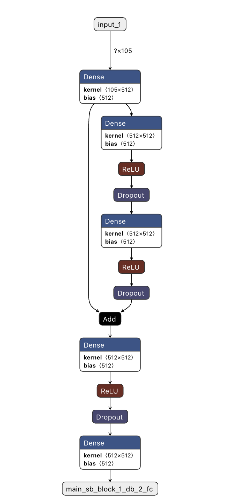

# openCL delegate issue with a sequence of Dense/FullyConnected nodes 

This repo contains scripts and a tool to reproduce the `openCL` delegate issue with a sequence of Dense/FullyConnected nodes. Our experiments revealed that if we use a sequence of Dense layers in a special pattern (see the following image), the corresponding tflite version of this model will generate a bunch of `nan` and `inf` values for certain random indices in certain runs. This issue happens with both FP16 and FP32 tflite versions. This issue can't be reproduced with the `XNNPACK` delegate. And also this issue is for the trained or partially trained models and we could not regenrate issue with dummy model. 



## Converting the model
* `model_files` folder contains the above-mentioned pattern (`sample.h5`) and its corresponding tflite version (`sample.tflite`). 
  * You can also use `convert_model.py` to convert this pattern to tflite.
  
  Note: `sample.h5` is extracted from a large trained model.

## tflite_inference tool 
We have implemented a small tool to feed a random input to our sample tflite model using `openCL` and `XNNPACK` delegates. You will see that the `openCL` delegate generates `inf` outputs while `XNNPACK` delegate generate values. 

### PREREQUISITES: ###
* Linux or Mac host computer
* Connectivity to the target device via adb
* Android NDK, version 22 or later
* CMake 3.18 or later

### BUILD INSTRUCTIONS ###
* Unzip the `tensorflow_lite_c_2_15_0.zip` file.
* In a terminal, from root folder:
```console
$ mkdir build
$ cd build
$ cmake -G "Unix Makefiles" -DTensorFlowLiteC_ROOT=../tensorflow_lite_c_2_15_0 -DCMAKE_SYSTEM_NAME=Android -DANDROID_ABI=arm64-v8a -DANDROID_STL=c++_shared -DANDROID_NATIVE_API_LEVEL=26 -DCMAKE_VERBOSE_MAKEFILE=ON -DCMAKE_TOOLCHAIN_FILE=<path-to-ndk>/build/cmake/android.toolchain.cmake -DCMAKE_BUILD_TYPE=Release ..
$ make
```
* Here, you must replace <path-to-ndk> with the absolute path of the ndk installed on your computer. If you installed NDK through Android studio, it should be something similar to:
`$HOME/Android/ndk/25.1.8937393`

* `tensorflow_lite_c_2_15_0` is TensorflowFlow Lite library package.
### Run INSTRUCTIONS ###
WARNING: This step will write to your `/data/local/tmp` folder on device. Please make sure existing files in that folder are backed up as needed.

In a terminal, from root folder:
```console
$ adb push ./build/model_test /data/local/tmp
$ adb push ./model_files /data/local/tmp
$ adb push ./tensorflow_lite_c_2_15_0/lib/aarch64/libtensorflowlite_c.so /data/local/tmp
$ adb push ./tensorflow_lite_c_2_15_0/lib/aarch64/libtensorflowlite_gpu_delegate.so /data/local/tmp
$ adb push ./tensorflow_lite_c_2_15_0/lib/aarch64/libc++_shared.so /data/local/tmp
```

To run the tool:
```console
$ adb shell "cd /data/local/tmp && LD_LIBRARY_PATH=. ./model_test --model=model_files/sample.tflite --input_shape=1,105 --output_shape=1,512"
```

The output should be something like this:
```console
INFO: Created TensorFlow Lite delegate for GPU.
INFO: Initialized TensorFlow Lite runtime.
VERBOSE: Replacing 20 out of 20 node(s) with delegate (TfLiteGpuDelegateV2) node, yielding 1 partitions for the whole graph.
INFO: Initialized OpenCL-based API.
INFO: Created 1 GPU delegate kernels.
INFO: Created TensorFlow Lite XNNPACK delegate for CPU.
VERBOSE: Replacing 20 out of 20 node(s) with delegate (TfLiteXNNPackDelegate) node, yielding 1 partitions for the whole graph.
OpenCL output:
-32560, -39104, -48128, 24512, -inf, -9808, -inf, -41344, -22960, -54048, -49792, -inf, inf, -1512, -inf, -28368, -inf, -inf, -9864, -14296, -inf, 863, -11792, -48832, -inf, -51040, -20864, -32176, -inf, -10928, -26560, -inf, -21344, -inf, -41632, -22544, -60128, -44832, -37856, -37152, 21216, -inf, -38304, -inf, -15312, 17344, -inf, -18816, -40960, -14112, -44416, -7144, 25568, 18880, -54496, -50400, -23456, -18336, -31072, -inf, inf, -13680, -inf, 784, -52544, -19488, -37856, 36224, -50880, -14416, -13944, -inf, -37952, -41856, 3120, -50176, -38272, -45728, -inf, 9872, -inf, -52768, -40512, -inf, -57664, -64192, inf, -61120, -inf, 11736, -inf, -29488, -35200, -inf, -inf, -inf, -36288, -inf, -43648, -inf, -inf, -14968, -50624, -15208, -inf, 8320, -21344, -65472, 51008, -18768, inf, -9824, -32832, 15624, 14648, -37280, -34688, 42432, -19264, -22688, inf, -34, -32896, -inf, -46272, -62176, -50848, -29344, -inf, 9248, -2568, 16152, -22912, -28880, -4408, -17696, inf, -17632, 32960, -1622, -41536, -36928, -inf, -31872, -62080, -inf, -47296, -inf, -54336, -63904, -35776, 32064, -623.5, -inf, -2802, -46464, -inf, -inf, -inf, -17408, -63360, -10992, -inf, -28960, -56256, -33152, -16296, -inf, 1054, 27456, -57312, -17760, -29312, -50368, -7928, -38368, inf, -inf, -33376, -57664, -20592, 1857, 96, -50560, -11512, -936, 808, -10944, 10376, -44736, -23456, -36320, -51392, -inf, -25760, 14320, -inf, 2280, -52928, -18944, -24928, 3820, -63776, 13120, 17712, -60416, -inf, 10096, -26656, -46688, inf, -3528, -22256, -30512, -61728, 3274, -16232, -18912, -39552, -15896, 1952, -57280, 45216, -3566, -10440, -inf, -18320, -2868, -40800, -29600, -20640, -52928, -inf, 4104, -160, -46240, -32800, -51392, -inf, -inf, 480, -34208, -inf, -5936, -49376, -11184, -37312, 18464, 9872, 20816, 62240, inf, -35360, -12288, -18624, -25728, -23328, 18128, -4580, -inf, 1204, -inf, -52384, -20416, -24928, -22832, -48224, -inf, -8328, -inf, 35168, -53440, -52512, -29024, -39264, -28992, 7340, -5240, -4692, -inf, -60384, 9720, -12272, -47616, -20128, -28832, -10816, -36096, -28944, -31872, -34624, -48000, -inf, -18336, inf, -11232, -22880, -49632, -22400, -inf, 11888, -31712, -29312, -44512, -10112, -49440, -20736, -45088, -30080, -inf, -18624, -15440, -14032, -22080, -4492, -43776, -43456, -inf, -39520, -8040, -16256, -49472, -inf, 480, -38496, -inf, -29920, -33696, -inf, -13808, -inf, -4096, -44480, -inf, -41920, -27280, 8424, -18800, -31120, 20352, -14320, -34336, inf, -22208, -inf, -11120, -38048, -inf, -29584, -17728, 2448, 8904, -40384, -32672, inf, -25312, -19904, -62272, -53216, -21472, -5024, 14048, -inf, -53568, -24832, 12704, 21696, -15600, -inf, -35840, -7208, -52160, 7224, 23984, -inf, -55680, -22816, -313, -19280, -inf, -29952, -57024, -12320, -57056, -32000, inf, 264, -15184, -25824, -12704, inf, 5488, -48128, -34592, 16864, -27840, -inf, inf, -21056, -30432, -63104, -32864, -52480, -29728, -14736, -53088, -inf, -5648, -51648, -12912, -17392, -22880, -inf, -24944, -inf, -35616, -18272, 2776, 33536, -inf, 13592, -56032, -38976, -inf, -36320, -inf, -15936, -5452, -12832, inf, 2688, -inf, -inf, -45696, 4600, 10560, 39840, -44928, -24480, -15496, -13728, -23840, -8152, inf, 44800, -50112, -34816, -45248, 4348, -60672, -inf, -38912, -24640, 45376, -43008, -inf, -22592, -inf, -49024, -8752, -26368, -59520, -inf, inf, -19232, -26976, 6864, -inf, -inf, -10544, 2048, -54144, 12688, -14896, -52352, -28672, -6476, -inf, -22304, -50272, -572, -inf, -63136, -32368, -29088, -inf, -20592, 38272, -32928, -1964, 6436, -63232, -49216, inf, -inf, -46144, 8664, -16736, -6252, -10080, -37344, -inf, -40224, -9184, -63232, 31040, 48512, -inf, -25936, -16960, -38400, -inf, 
xnnpack output:
-32602.6, -39153.8, -48130.7, 24533.9, -97754.5, -9813.17, -78416.9, -41379.8, -23000.9, -54113.5, -49708.1, -90870.6, 112539, -1498.08, -105075, -28376.5, -96743.4, -67027, -9879.88, -14326, -99808.9, 876.697, -11796.4, -48918.8, -86674, -51095.7, -20869.1, -32172.9, -75786.8, -10932.7, -26558.5, -111540, -21370.2, -75916.5, -41692.8, -22555.8, -60117.6, -44885.5, -37903, -37185.3, 21240.9, -96867.4, -38309.8, -98089.4, -15305.5, 17378.7, -69606.7, -18815.7, -40961.3, -14116.8, -44516.3, -7135.71, 25650.9, 18892.4, -54582, -50486.6, -23488.1, -18343.2, -31139.2, -110628, 147622, -13690.4, -97479.3, 775.311, -52595.7, -19534.6, -37845.2, 36283.4, -50934, -14428.6, -13943.9, -88902.5, -38031.8, -41894.4, 3089.25, -50272.5, -38367.5, -45794, -84999.6, 9848.28, -82236.5, -52796.5, -40552.8, -68395.4, -57743, -64313.3, 120802, -61277, -83226.8, 11730.2, -172247, -29550.8, -35194, -87140.8, -134325, -72781.6, -36351.5, -89607.2, -43687.6, -76190.5, -87190.9, -14935.5, -50699.9, -15178.3, -76771.6, 8369.87, -21325.7, -65577.2, 51105.4, -18785.7, 211149, -9776.8, -32829.2, 15648.5, 14615.1, -37324.9, -34665.2, 42520.9, -19249.1, -22687.5, 130738, -17.5757, -32888.3, -87196.8, -46313.3, -62267, -50868.6, -29366.5, -77546.6, 9263.18, -2530, 16222.9, -22978.4, -28918.1, -4404.59, -17705.4, 106796, -17639.8, 32957.3, -1627.28, -41606.9, -36981, -91756.2, -31891.5, -62184.1, -73724.9, -47357.9, -83785, -54367.3, -64025, -35797.9, 32158, -596.924, -93072.2, -2785.83, -46489.7, -113135, -80649.5, -71818.2, -17404.5, -63420, -10963.1, -79448.3, -28990.8, -56335.1, -33207.6, -16306.3, -98066.2, 1019.22, 27524, -57275.1, -17764.8, -29334.4, -50448.8, -7939.69, -38364.6, 143965, -79212.5, -33384, -57731.9, -20611.2, 1879.06, 124.458, -50620.8, -11497.4, -953.572, 792.05, -10975.9, 10395.9, -44772.4, -23461.6, -36359.3, -51448.3, -118438, -25745.4, 14409.5, -69919.6, 2279.27, -53003.4, -18988.7, -24951.4, 3841.02, -63828.5, 13144.9, 17726, -60544.2, -98083, 10098.8, -26651.4, -46733.6, 96513.6, -3514.97, -22287.5, -30523.8, -61755.1, 3274.11, -16295.1, -18846.9, -39613.6, -15917.4, 1978.2, -57331.9, 45282.1, -3559.37, -10438.5, -128960, -18304.9, -2809.6, -40857.3, -29636.3, -20663.6, -52982.8, -169738, 4142.68, -150.012, -46285.8, -32850.6, -51403.3, -71676.2, -94986.2, 502.422, -34302.4, -79875.3, -5906.85, -49429.4, -11176.3, -37346.6, 18503.6, 9918.16, 20895.9, 62369.5, 83044, -35434.9, -12288.7, -18625.7, -25739.6, -23342.1, 18165.5, -4588.18, -77916.5, 1227.95, -107791, -52435.7, -20458.7, -24960.1, -22840.3, -48242.7, -86124.1, -8329.91, -90517.7, 35232.9, -53508.5, -52555.7, -29071.1, -39288, -29054.6, 7378.69, -5253.97, -4642.87, -76704, -60455, 9733.98, -12277.7, -47622.9, -20171.4, -28883.4, -10830, -36099.5, -28945.7, -31871.8, -34673.4, -48034.4, -79795.3, -18381.7, 99478, -11220.3, -22901.2, -49667.7, -22424.2, -80609, 11911.4, -31752.4, -29359.2, -44537.2, -10079.8, -49488.1, -20727.2, -45124.1, -30087.6, -173750, -18625.6, -15419.5, -14019.4, -22074.8, -4515.52, -43850.8, -43459.9, -100810, -39559.8, -8027.02, -16241.3, -49520.6, -68827, 521.5, -38479.9, -81541.6, -29957.8, -33732.2, -145000, -13817, -99238.5, -4157.95, -44565.1, -129664, -41950.4, -27301.9, 8449.94, -18796, -31210.5, 20404.8, -14362, -34367.9, 88568.7, -22198.3, -89847.6, -11122.2, -38095.2, -150501, -29608.2, -17693.2, 2467.82, 8926.48, -40424, -32748.8, 107869, -25304.9, -19940.5, -62313.1, -53336.2, -21501, -5012.89, 14046.6, -83786.2, -53641.2, -24810.1, 12752.1, 21709.7, -15659.8, -88787.9, -35892.6, -7212.81, -52260.2, 7246.71, 23984.1, -77926.1, -55734.3, -22818.8, -282.182, -19305, -82601.4, -29979.4, -57160.9, -12302.2, -57110.6, -32074.4, 79203.5, 268.22, -15198.8, -25830.2, -12701.4, 85859.1, 5564.02, -48190.3, -34626.1, 16898.3, -27858.9, -70120.8, 111374, -21035.8, -30453.5, -63168.6, -32893.2, -52539.9, -29726.1, -14730.8, -53160.1, -81385.8, -5648.63, -51723.8, -12906.9, -17399.3, -22895.2, -88670.9, -24990.7, -77438.5, -35669.3, -18296, 2808.27, 33589.3, -90136.3, 13614.8, -56096.5, -38998.1, -82318.9, -36316.2, -71410.5, -15914.4, -5458.22, -12763.2, 86076.5, 2753.43, -117908, -114232, -45749.2, 4594.06, 10574.2, 39932.1, -44991.1, -24485.1, -15486.2, -13730.7, -23853, -8159.53, 181497, 44863, -50154.5, -34799.4, -45269.2, 4363.45, -60702.5, -82994.5, -38931.9, -24665.2, 45462.6, -43066, -77708.7, -22606.9, -78573.2, -49042.5, -8725.07, -26438.8, -59508.2, -114108, 81879.4, -19234.6, -27004.2, 6852.8, -130338, -75856.2, -10535.6, 2068.16, -54165.8, 12694.5, -14912.6, -52434, -28680.2, -6442.04, -87720.9, -22310.7, -50317.5, -530.088, -84622.6, -63203.5, -32362.9, -29090.5, -111945, -20624.2, 38300.5, -32946.5, -1924.16, 6460.49, -63291.4, -49290, 83232.9, -93448.9, -46161.6, 8686.46, -16744, -6280.4, -10076.5, -37415.9, -83593.8, -40268.2, -9153.93, -63296.7, 31075.9, 48592.4, -93033.5, -25971.1, -16967.3, -38405, -111579, 
```

